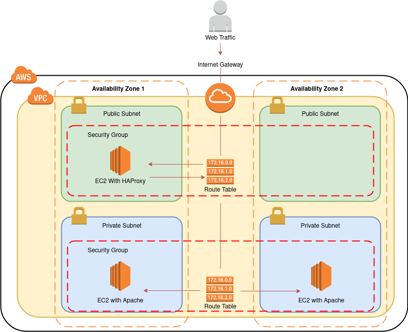

# hashitalks-latam

## Pre-requisitos

Antes de ejecutar el despliegue de la infraestructura asegúrese de lo siguiente:

- Tener instalado terraform v0.13.5 o Superior.
- Tener instalada la CLI de [AWS](https://docs.aws.amazon.com/cli/latest/userguide/install-cliv2.html) versión 2.
- Asegurarse de estar autenticado con AWS de alguna de las formas como lo indica la siguiente [documentación](https://registry.terraform.io/providers/hashicorp/aws/latest/docs).

## Arquitectura de despliegue



El diagrama anterior es un detalle de los componentes que se despliegan en la nube de con el código contenido en este repositorio y sirven como demostración para comprender el funcionamiento de un flujo completo de aprovisionamiento usando IaC, CaC e infraestructura inmutable. El despliegue de la infraestructura se realiza en la región de ohio (us-east-2). Siéntase en la libertad de cambiarla según su necesidad, esta información se encuentra en los archivos de variables de cada ejecución (networking, backend y frontend).

###  Ejecución del Flujo de aprovisionamiento 

```bash
$ make create_pipeline
```

### Actualización Frontend

```bash
$ make update_frontend
```

> **Nota**: esta ejecución se realiza, cuando se cambia la variable del número de instancias que componen la pagina web.

### Destrucción del ambiente

```bash
$ make destroy_pipeline
```

